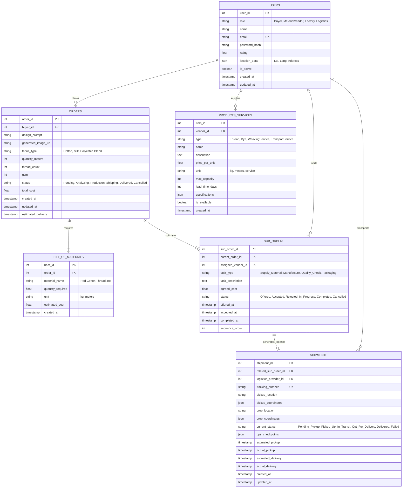

# FabricFlow Database Schema

## Entity Relationship Diagram



## Table Definitions

### 1. USERS
Stores all platform users across different roles.

```sql
CREATE TABLE users (
    user_id SERIAL PRIMARY KEY,
    role VARCHAR(50) NOT NULL CHECK (role IN ('Buyer', 'MaterialVendor', 'Factory', 'Logistics')),
    name VARCHAR(255) NOT NULL,
    email VARCHAR(255) UNIQUE NOT NULL,
    password_hash TEXT NOT NULL,
    phone VARCHAR(20),
    rating DECIMAL(3,2) DEFAULT 0.00,
    location_data JSONB, -- {lat, lng, address, city, state, country, postal_code}
    profile_image_url TEXT,
    business_name VARCHAR(255),
    business_registration_no VARCHAR(100),
    is_active BOOLEAN DEFAULT TRUE,
    is_verified BOOLEAN DEFAULT FALSE,
    created_at TIMESTAMP DEFAULT CURRENT_TIMESTAMP,
    updated_at TIMESTAMP DEFAULT CURRENT_TIMESTAMP
);

CREATE INDEX idx_users_role ON users(role);
CREATE INDEX idx_users_email ON users(email);
CREATE INDEX idx_users_rating ON users(rating);
```

### 2. PRODUCTS_SERVICES
Catalog of items/services offered by vendors.

```sql
CREATE TABLE products_services (
    item_id SERIAL PRIMARY KEY,
    vendor_id INTEGER REFERENCES users(user_id) ON DELETE CASCADE,
    type VARCHAR(100) NOT NULL CHECK (type IN ('Thread', 'Dye', 'Chemical', 'WeavingService', 'KnittingService', 'DyeingService', 'FinishingService', 'TransportService', 'QualityCheckService')),
    name VARCHAR(255) NOT NULL,
    description TEXT,
    price_per_unit DECIMAL(10,2) NOT NULL,
    unit VARCHAR(50) NOT NULL, -- kg, meters, service, trip
    max_capacity INTEGER, -- Maximum quantity/service capacity
    min_order_quantity INTEGER DEFAULT 1,
    lead_time_days INTEGER NOT NULL, -- How many days to fulfill
    specifications JSONB, -- Material specs, certifications, etc.
    is_available BOOLEAN DEFAULT TRUE,
    created_at TIMESTAMP DEFAULT CURRENT_TIMESTAMP,
    updated_at TIMESTAMP DEFAULT CURRENT_TIMESTAMP
);

CREATE INDEX idx_products_vendor ON products_services(vendor_id);
CREATE INDEX idx_products_type ON products_services(type);
CREATE INDEX idx_products_available ON products_services(is_available);
```

### 3. ORDERS
Main order entity from buyers.

```sql
CREATE TABLE orders (
    order_id SERIAL PRIMARY KEY,
    buyer_id INTEGER REFERENCES users(user_id) ON DELETE CASCADE,
    design_prompt TEXT,
    generated_image_url TEXT,
    fabric_type VARCHAR(100) NOT NULL,
    quantity_meters INTEGER NOT NULL,
    thread_count INTEGER,
    gsm INTEGER, -- Grams per square meter
    status VARCHAR(50) NOT NULL DEFAULT 'Pending' CHECK (status IN ('Pending', 'Analyzing', 'Bidding', 'Accepted', 'Production', 'Shipping', 'Delivered', 'Cancelled', 'Disputed')),
    total_cost DECIMAL(12,2),
    optimization_score DECIMAL(5,2), -- How optimal the selected route is
    created_at TIMESTAMP DEFAULT CURRENT_TIMESTAMP,
    updated_at TIMESTAMP DEFAULT CURRENT_TIMESTAMP,
    estimated_delivery TIMESTAMP,
    actual_delivery TIMESTAMP
);

CREATE INDEX idx_orders_buyer ON orders(buyer_id);
CREATE INDEX idx_orders_status ON orders(status);
CREATE INDEX idx_orders_created ON orders(created_at);
```

### 4. BILL_OF_MATERIALS
Auto-calculated material requirements for each order.

```sql
CREATE TABLE bill_of_materials (
    bom_id SERIAL PRIMARY KEY,
    order_id INTEGER REFERENCES orders(order_id) ON DELETE CASCADE,
    material_name VARCHAR(255) NOT NULL,
    material_type VARCHAR(100) NOT NULL,
    quantity_required DECIMAL(10,2) NOT NULL,
    unit VARCHAR(50) NOT NULL,
    estimated_cost DECIMAL(10,2),
    created_at TIMESTAMP DEFAULT CURRENT_TIMESTAMP
);

CREATE INDEX idx_bom_order ON bill_of_materials(order_id);
```

### 5. SUB_ORDERS
The critical table that splits main orders into vendor-specific tasks.

```sql
CREATE TABLE sub_orders (
    sub_order_id SERIAL PRIMARY KEY,
    parent_order_id INTEGER REFERENCES orders(order_id) ON DELETE CASCADE,
    assigned_vendor_id INTEGER REFERENCES users(user_id),
    task_type VARCHAR(100) NOT NULL CHECK (task_type IN ('Supply_Material', 'Manufacture', 'Weaving', 'Knitting', 'Dyeing', 'Finishing', 'Quality_Check', 'Packaging', 'Transport')),
    task_description TEXT,
    agreed_cost DECIMAL(10,2),
    status VARCHAR(50) NOT NULL DEFAULT 'Offered' CHECK (status IN ('Offered', 'Accepted', 'Rejected', 'In_Progress', 'Completed', 'Cancelled')),
    offered_at TIMESTAMP DEFAULT CURRENT_TIMESTAMP,
    accepted_at TIMESTAMP,
    started_at TIMESTAMP,
    completed_at TIMESTAMP,
    sequence_order INTEGER NOT NULL, -- Order of execution (1, 2, 3...)
    dependencies JSONB, -- Array of sub_order_ids that must complete first
    notes TEXT
);

CREATE INDEX idx_suborders_parent ON sub_orders(parent_order_id);
CREATE INDEX idx_suborders_vendor ON sub_orders(assigned_vendor_id);
CREATE INDEX idx_suborders_status ON sub_orders(status);
CREATE INDEX idx_suborders_sequence ON sub_orders(sequence_order);
```

### 6. SHIPMENTS
Logistics and tracking information.

```sql
CREATE TABLE shipments (
    shipment_id SERIAL PRIMARY KEY,
    related_sub_order_id INTEGER REFERENCES sub_orders(sub_order_id),
    logistics_provider_id INTEGER REFERENCES users(user_id),
    tracking_number VARCHAR(100) UNIQUE,
    pickup_location TEXT NOT NULL,
    pickup_coordinates JSONB, -- {lat, lng}
    drop_location TEXT NOT NULL,
    drop_coordinates JSONB, -- {lat, lng}
    current_status VARCHAR(100) NOT NULL DEFAULT 'Pending_Pickup' CHECK (current_status IN ('Pending_Pickup', 'Picked_Up', 'In_Transit', 'At_Checkpoint', 'Out_For_Delivery', 'Delivered', 'Failed', 'Returned')),
    gps_checkpoints JSONB, -- Array of {lat, lng, timestamp, location_name}
    vehicle_info JSONB, -- {type, number, driver_name, driver_phone}
    estimated_pickup TIMESTAMP,
    actual_pickup TIMESTAMP,
    estimated_delivery TIMESTAMP,
    actual_delivery TIMESTAMP,
    delivery_proof_url TEXT, -- Photo/signature
    created_at TIMESTAMP DEFAULT CURRENT_TIMESTAMP,
    updated_at TIMESTAMP DEFAULT CURRENT_TIMESTAMP
);

CREATE INDEX idx_shipments_suborder ON shipments(related_sub_order_id);
CREATE INDEX idx_shipments_provider ON shipments(logistics_provider_id);
CREATE INDEX idx_shipments_tracking ON shipments(tracking_number);
CREATE INDEX idx_shipments_status ON shipments(current_status);
```

## Additional Tables

### 7. MESSAGES (Chat System)

```sql
CREATE TABLE messages (
    message_id SERIAL PRIMARY KEY,
    order_id INTEGER REFERENCES orders(order_id),
    sender_id INTEGER REFERENCES users(user_id),
    receiver_id INTEGER REFERENCES users(user_id),
    message_text TEXT NOT NULL,
    attachment_url TEXT,
    is_read BOOLEAN DEFAULT FALSE,
    created_at TIMESTAMP DEFAULT CURRENT_TIMESTAMP
);

CREATE INDEX idx_messages_order ON messages(order_id);
CREATE INDEX idx_messages_sender ON messages(sender_id);
CREATE INDEX idx_messages_receiver ON messages(receiver_id);
```

### 8. NOTIFICATIONS

```sql
CREATE TABLE notifications (
    notification_id SERIAL PRIMARY KEY,
    user_id INTEGER REFERENCES users(user_id) ON DELETE CASCADE,
    type VARCHAR(100) NOT NULL, -- order_update, payment, message, etc.
    title VARCHAR(255) NOT NULL,
    content TEXT NOT NULL,
    related_entity_type VARCHAR(50), -- order, sub_order, shipment
    related_entity_id INTEGER,
    is_read BOOLEAN DEFAULT FALSE,
    created_at TIMESTAMP DEFAULT CURRENT_TIMESTAMP
);

CREATE INDEX idx_notifications_user ON notifications(user_id);
CREATE INDEX idx_notifications_read ON notifications(is_read);
```

### 9. PAYMENTS

```sql
CREATE TABLE payments (
    payment_id SERIAL PRIMARY KEY,
    order_id INTEGER REFERENCES orders(order_id),
    sub_order_id INTEGER REFERENCES sub_orders(sub_order_id),
    payer_id INTEGER REFERENCES users(user_id),
    payee_id INTEGER REFERENCES users(user_id),
    amount DECIMAL(12,2) NOT NULL,
    currency VARCHAR(3) DEFAULT 'USD',
    payment_type VARCHAR(50) CHECK (payment_type IN ('Advance', 'Milestone', 'Final', 'Refund')),
    payment_status VARCHAR(50) DEFAULT 'Pending' CHECK (payment_status IN ('Pending', 'Escrowed', 'Released', 'Failed', 'Refunded')),
    payment_gateway VARCHAR(100), -- Stripe, Razorpay, etc.
    transaction_id VARCHAR(255) UNIQUE,
    created_at TIMESTAMP DEFAULT CURRENT_TIMESTAMP,
    released_at TIMESTAMP
);

CREATE INDEX idx_payments_order ON payments(order_id);
CREATE INDEX idx_payments_payer ON payments(payer_id);
CREATE INDEX idx_payments_payee ON payments(payee_id);
```

### 10. VENDOR_RATINGS

```sql
CREATE TABLE vendor_ratings (
    rating_id SERIAL PRIMARY KEY,
    order_id INTEGER REFERENCES orders(order_id),
    vendor_id INTEGER REFERENCES users(user_id),
    rated_by INTEGER REFERENCES users(user_id),
    rating DECIMAL(3,2) CHECK (rating BETWEEN 0 AND 5),
    review_text TEXT,
    criteria JSONB, -- {quality: 4.5, speed: 5, communication: 4}
    created_at TIMESTAMP DEFAULT CURRENT_TIMESTAMP
);

CREATE INDEX idx_ratings_vendor ON vendor_ratings(vendor_id);
CREATE INDEX idx_ratings_order ON vendor_ratings(order_id);
```

## Key Relationships

1. **One Buyer Order → Multiple Sub-Orders**
   - A single buyer order is decomposed into multiple tasks
   - Each sub-order represents a specific vendor's contribution
   - Sub-orders execute in sequence based on `sequence_order`

2. **Sub-Orders → Shipments**
   - Each sub-order may generate one or more shipments
   - Tracks material/product movement between vendors

3. **Users → Multiple Roles**
   - A user account has a single role (Buyer, MaterialVendor, Factory, Logistics)
   - Future: Support for multi-role accounts

4. **Order → BOM → Sub-Orders**
   - Order generates BOM (what materials are needed)
   - BOM informs which vendors to query
   - Sub-orders created based on optimal vendor selection

## Optimization Query Patterns

### Find Best Vendors for a Material

```sql
SELECT 
    u.user_id,
    u.name,
    u.rating,
    ps.price_per_unit,
    ps.lead_time_days,
    u.location_data
FROM products_services ps
JOIN users u ON ps.vendor_id = u.user_id
WHERE 
    ps.type = 'Thread' 
    AND ps.is_available = TRUE
    AND u.is_active = TRUE
ORDER BY 
    (ps.price_per_unit * 0.5) + (ps.lead_time_days * 0.3) + ((5 - u.rating) * 0.2) ASC
LIMIT 10;
```

### Track Order Lifecycle

```sql
SELECT 
    o.order_id,
    o.status AS order_status,
    so.sub_order_id,
    so.task_type,
    so.status AS task_status,
    u.name AS vendor_name,
    s.current_status AS shipment_status,
    s.gps_checkpoints
FROM orders o
LEFT JOIN sub_orders so ON o.order_id = so.parent_order_id
LEFT JOIN users u ON so.assigned_vendor_id = u.user_id
LEFT JOIN shipments s ON so.sub_order_id = s.related_sub_order_id
WHERE o.order_id = $1
ORDER BY so.sequence_order ASC;
```

## Indexes for Performance

All critical indexes have been defined inline with table definitions. Additional composite indexes may be added based on query patterns:

```sql
-- Composite index for vendor optimization
CREATE INDEX idx_products_type_available_price ON products_services(type, is_available, price_per_unit);

-- Composite index for order tracking
CREATE INDEX idx_orders_buyer_status_created ON orders(buyer_id, status, created_at DESC);

-- Geospatial index for location-based queries (if using PostGIS)
CREATE INDEX idx_users_location ON users USING GIST (location_data);
```

## Database Triggers

### Update Timestamps

```sql
CREATE OR REPLACE FUNCTION update_modified_column()
RETURNS TRIGGER AS $$
BEGIN
    NEW.updated_at = NOW();
    RETURN NEW;
END;
$$ LANGUAGE plpgsql;

CREATE TRIGGER update_users_modtime BEFORE UPDATE ON users
FOR EACH ROW EXECUTE FUNCTION update_modified_column();

CREATE TRIGGER update_orders_modtime BEFORE UPDATE ON orders
FOR EACH ROW EXECUTE FUNCTION update_modified_column();

-- Apply to other tables as needed
```

### Auto-Update User Ratings

```sql
CREATE OR REPLACE FUNCTION update_vendor_rating()
RETURNS TRIGGER AS $$
BEGIN
    UPDATE users
    SET rating = (
        SELECT AVG(rating)
        FROM vendor_ratings
        WHERE vendor_id = NEW.vendor_id
    )
    WHERE user_id = NEW.vendor_id;
    RETURN NEW;
END;
$$ LANGUAGE plpgsql;

CREATE TRIGGER update_rating_after_review
AFTER INSERT ON vendor_ratings
FOR EACH ROW EXECUTE FUNCTION update_vendor_rating();
```

## Backup & Maintenance

### Recommended Backup Strategy
- Full backup: Daily
- Incremental backup: Every 6 hours
- Transaction log backup: Hourly
- Retention: 30 days

### Maintenance Tasks
```sql
-- Vacuum and analyze weekly
VACUUM ANALYZE;

-- Reindex monthly
REINDEX DATABASE fabricflow;

-- Update statistics
ANALYZE;
```

## Scaling Considerations

1. **Partitioning**: Partition `orders` and `shipments` by date for improved query performance
2. **Read Replicas**: Set up read replicas for reporting and analytics
3. **Connection Pooling**: Use PgBouncer for connection pooling
4. **Caching**: Cache frequently accessed data (vendor lists, product catalogs) in Redis
